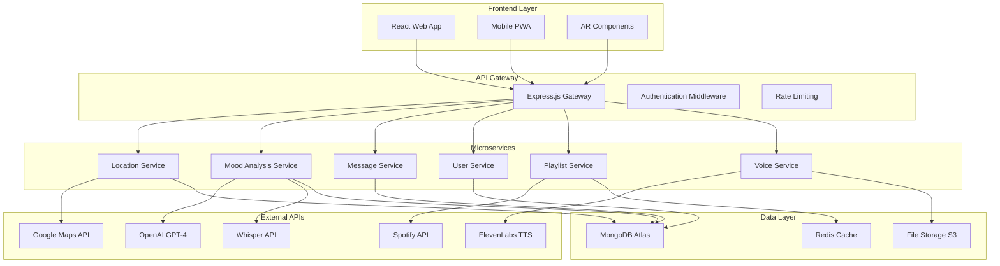

# Design Document

## Overview

Whisper Walls is a full-stack location-based emotional connection platform that combines real-time mood detection, anonymous messaging, and AI-powered relationship insights. The system architecture follows a microservices approach with a React frontend, Node.js backend, MongoDB database, and integrated ML models for emotion analysis. The platform emphasizes beautiful, romantic UI design with dreamy animations while maintaining robust security and scalability.

## Architecture

### High-Level Architecture



### Technology Stack

**Frontend:**
- React 18 with TypeScript
- Framer Motion for animations
- Three.js for AR visualizations
- Tailwind CSS for styling
- PWA capabilities for mobile

**Backend:**
- Node.js with Express.js
- TypeScript for type safety
- Socket.io for real-time features
- JWT authentication
- Helmet.js for security

**Database:**
- MongoDB Atlas for primary data
- Redis for caching and sessions
- AWS S3 for file storage

**ML & AI:**
- OpenAI GPT-4 for conversation prompts
- Whisper API for speech-to-text
- Custom sentiment analysis model
- TensorFlow.js for client-side processing

**External Integrations:**
- Spotify Web API for playlist generation
- ElevenLabs for text-to-speech
- Google Maps API for location services
- WebRTC for voice recording

## Components and Interfaces

### Frontend Components

#### Core UI Components
```typescript
// Emotional Design System
interface EmotionalTheme {
  colors: {
    joy: string;
    nostalgia: string;
    hope: string;
    stress: string;
    love: string;
  };
  animations: {
    heartbeat: Animation;
    fadeWhisper: Animation;
    bloomMatch: Animation;
    butterflyTransition: Animation;
  };
}

// Location-based Message Component
interface WhisperNote {
  id: string;
  content: string;
  location: GeoLocation;
  moodEmbedding: number[];
  timestamp: Date;
  isEphemeral: boolean;
}

// Mood Visualization Component
interface MoodVisualization {
  type: 'heatmap' | 'line' | 'aura' | 'ar';
  data: MoodData[];
  timeRange: DateRange;
  animations: AnimationConfig;
}
```

#### Animation System
```typescript
// Butterflies in Motion Animation Framework
interface MicroInteraction {
  trigger: 'hover' | 'click' | 'scroll' | 'match';
  animation: {
    type: 'bloom' | 'fade' | 'flutter' | 'pulse';
    duration: number;
    easing: string;
    particles?: ParticleConfig;
  };
}

// Romantic Animation Presets
const ROMANTIC_ANIMATIONS = {
  loveNoteFade: {
    opacity: [1, 0.7, 0],
    scale: [1, 1.05, 0.95],
    duration: 3000,
    easing: 'ease-out'
  },
  matchBloom: {
    scale: [0, 1.2, 1],
    rotate: [0, 360],
    particles: 'hearts',
    duration: 2000
  },
  butterflyTransition: {
    path: 'M 0,0 Q 50,25 100,0',
    duration: 1500,
    particles: 'sparkles'
  }
};
```

### Backend Services

#### Location Service
```typescript
interface LocationService {
  findNearbyMessages(location: GeoLocation, radius: number): Promise<WhisperNote[]>;
  createLocationMessage(message: CreateMessageRequest): Promise<WhisperNote>;
  validateLocation(location: GeoLocation): boolean;
  getLocationInsights(location: GeoLocation): Promise<LocationInsights>;
}

interface GeoLocation {
  latitude: number;
  longitude: number;
  accuracy: number;
  timestamp: Date;
}
```

#### Mood Analysis Service
```typescript
interface MoodAnalysisService {
  analyzeTextMood(text: string): Promise<MoodEmbedding>;
  analyzeVoiceMood(audioBuffer: Buffer): Promise<MoodEmbedding>;
  generateMoodInsights(history: MoodEmbedding[]): Promise<MoodInsights>;
  blendCoupleMoods(mood1: MoodEmbedding, mood2: MoodEmbedding): Promise<MoodEmbedding>;
}

interface MoodEmbedding {
  emotions: {
    joy: number;
    sadness: number;
    anger: number;
    fear: number;
    surprise: number;
    disgust: number;
    trust: number;
    anticipation: number;
  };
  sentiment: number; // -1 to 1
  intensity: number; // 0 to 1
  timestamp: Date;
}
```

#### Playlist Generation Service
```typescript
interface PlaylistService {
  generateMoodPlaylist(mood: MoodEmbedding, preferences: UserPreferences): Promise<Playlist>;
  createCouplePlaylist(blendedMood: MoodEmbedding, users: User[]): Promise<Playlist>;
  getSpotifyRecommendations(seedData: SpotifySeeds): Promise<Track[]>;
}

interface SpotifySeeds {
  genres: string[];
  acousticness: number;
  danceability: number;
  energy: number;
  valence: number;
}
```

### Connection Discovery System

#### Beyond the Swipe Matching
```typescript
interface ConnectionDiscovery {
  generateStoryCards(user: User): Promise<StoryCard[]>;
  createQuestionPrompts(compatibility: CompatibilityData): Promise<Question[]>;
  scheduleTimeBasedReveal(match: PotentialMatch): Promise<RevealSchedule>;
  calculateDiscoveryScore(interaction: UserInteraction): number;
}

interface StoryCard {
  id: string;
  type: 'memory' | 'dream' | 'value' | 'experience';
  content: string;
  revealLevel: number; // 1-5, gradual reveal
  emotionalTone: string;
}

interface Question {
  id: string;
  text: string;
  type: 'multiple_choice' | 'open_ended' | 'scale';
  category: 'values' | 'lifestyle' | 'dreams' | 'personality';
  weight: number; // importance for matching
}
```

## Data Models

### Core Data Schemas

#### User Model
```typescript
interface User {
  _id: ObjectId;
  email: string;
  hashedPassword: string;
  profile: {
    displayName?: string;
    age?: number;
    bio?: string;
    interests: string[];
    location: GeoLocation;
  };
  moodHistory: MoodEmbedding[];
  preferences: {
    musicGenres: string[];
    discoveryRadius: number;
    privacyLevel: 'open' | 'selective' | 'private';
    notificationSettings: NotificationSettings;
  };
  relationships: {
    couples: ObjectId[];
    friends: ObjectId[];
    blocked: ObjectId[];
  };
  createdAt: Date;
  lastActive: Date;
}
```

#### Message Model
```typescript
interface Message {
  _id: ObjectId;
  content: string;
  location: {
    type: 'Point';
    coordinates: [number, number]; // [longitude, latitude]
  };
  moodEmbedding: MoodEmbedding;
  authorId?: ObjectId; // Optional for anonymous messages
  isAnonymous: boolean;
  isEphemeral: boolean;
  expiresAt?: Date;
  discoveredBy: ObjectId[];
  reactions: {
    userId: ObjectId;
    type: 'heart' | 'hug' | 'smile' | 'tear';
    timestamp: Date;
  }[];
  moderationStatus: 'pending' | 'approved' | 'rejected';
  createdAt: Date;
}
```

#### Couple/Relationship Model
```typescript
interface Relationship {
  _id: ObjectId;
  users: ObjectId[];
  type: 'couple' | 'friends' | 'family';
  bondingMetrics: {
    closeness: number; // 0-100
    empathy: number; // 0-100
    trust: number; // 0-100
    communicationFrequency: number;
    sharedActivities: number;
  };
  sharedJournal: {
    entries: JournalEntry[];
    memoryLog: string[];
  };
  preferences: {
    playlistSharing: boolean;
    moodBlending: boolean;
    jointReflections: boolean;
  };
  createdAt: Date;
  lastInteraction: Date;
}
```

#### Playlist Model
```typescript
interface Playlist {
  _id: ObjectId;
  name: string;
  description: string;
  moodContext: MoodEmbedding;
  tracks: {
    spotifyId: string;
    name: string;
    artist: string;
    moodScore: number;
  }[];
  isShared: boolean;
  collaborators: ObjectId[];
  spotifyPlaylistId?: string;
  createdAt: Date;
}
```

## Error Handling

### Error Classification System
```typescript
enum ErrorType {
  VALIDATION_ERROR = 'VALIDATION_ERROR',
  AUTHENTICATION_ERROR = 'AUTHENTICATION_ERROR',
  AUTHORIZATION_ERROR = 'AUTHORIZATION_ERROR',
  LOCATION_ERROR = 'LOCATION_ERROR',
  MOOD_ANALYSIS_ERROR = 'MOOD_ANALYSIS_ERROR',
  EXTERNAL_API_ERROR = 'EXTERNAL_API_ERROR',
  DATABASE_ERROR = 'DATABASE_ERROR',
  RATE_LIMIT_ERROR = 'RATE_LIMIT_ERROR'
}

interface ErrorResponse {
  type: ErrorType;
  message: string;
  details?: any;
  timestamp: Date;
  requestId: string;
}
```

### Graceful Degradation Strategy
- **Offline Mode**: Cache recent messages and mood data for offline viewing
- **API Failures**: Fallback to cached playlists and basic mood analysis
- **Location Issues**: Allow manual location input with reduced accuracy
- **Voice Processing**: Fallback to text input if speech recognition fails

### User-Friendly Error Messages
```typescript
const ERROR_MESSAGES = {
  LOCATION_DENIED: "We need location access to show you nearby whispers. Please enable location services.",
  MOOD_ANALYSIS_FAILED: "Having trouble reading your mood right now. Your message will still be beautiful!",
  SPOTIFY_UNAVAILABLE: "Music recommendations are taking a break. We'll have playlists ready soon!",
  VOICE_PROCESSING_ERROR: "Couldn't hear you clearly. Try typing your whisper instead?"
};
```

## Testing Strategy

### Frontend Testing
```typescript
// Component Testing with Emotional Interactions
describe('WhisperNote Component', () => {
  it('should display fade animation when note expires', async () => {
    const note = createMockNote({ isEphemeral: true });
    render(<WhisperNote note={note} />);
    
    await waitFor(() => {
      expect(screen.getByTestId('fade-animation')).toBeInTheDocument();
    });
  });
  
  it('should trigger heart flutter animation on interaction', () => {
    const note = createMockNote();
    render(<WhisperNote note={note} />);
    
    fireEvent.click(screen.getByRole('button'));
    expect(screen.getByTestId('heart-flutter')).toHaveClass('animate-flutter');
  });
});

// Mood Analysis Testing
describe('Mood Detection', () => {
  it('should correctly identify joyful emotions in text', async () => {
    const joyfulText = "I'm so happy and excited about this beautiful day!";
    const mood = await analyzeMood(joyfulText);
    
    expect(mood.emotions.joy).toBeGreaterThan(0.7);
    expect(mood.sentiment).toBeGreaterThan(0.5);
  });
});
```

### Backend Testing
```typescript
// Location Service Testing
describe('Location Service', () => {
  it('should find nearby messages within radius', async () => {
    const location = { latitude: 40.7128, longitude: -74.0060 };
    const messages = await locationService.findNearbyMessages(location, 1000);
    
    expect(messages).toBeDefined();
    expect(messages.length).toBeGreaterThan(0);
  });
  
  it('should validate location coordinates', () => {
    const invalidLocation = { latitude: 200, longitude: -200 };
    expect(locationService.validateLocation(invalidLocation)).toBe(false);
  });
});

// Mood Blending Testing
describe('Couple Mood Blending', () => {
  it('should create balanced mood centroid', async () => {
    const mood1 = createMockMood({ joy: 0.8, sadness: 0.2 });
    const mood2 = createMockMood({ joy: 0.4, sadness: 0.6 });
    
    const blended = await moodService.blendCoupleMoods(mood1, mood2);
    expect(blended.emotions.joy).toBeCloseTo(0.6, 1);
  });
});
```

### Integration Testing
```typescript
// End-to-End Emotional Journey Testing
describe('Complete User Journey', () => {
  it('should handle full whisper creation and discovery flow', async () => {
    // Create user and authenticate
    const user = await createTestUser();
    const token = await authenticateUser(user);
    
    // Create whisper with mood
    const whisperData = {
      content: "Sending love to whoever finds this!",
      location: { latitude: 40.7128, longitude: -74.0060 }
    };
    
    const response = await request(app)
      .post('/api/whispers')
      .set('Authorization', `Bearer ${token}`)
      .send(whisperData)
      .expect(201);
    
    // Verify mood analysis was performed
    expect(response.body.moodEmbedding).toBeDefined();
    expect(response.body.moodEmbedding.emotions.joy).toBeGreaterThan(0.5);
    
    // Test discovery by another user
    const discoverer = await createTestUser();
    const discovererToken = await authenticateUser(discoverer);
    
    const nearbyWhispers = await request(app)
      .get('/api/whispers/nearby')
      .set('Authorization', `Bearer ${discovererToken}`)
      .query({ lat: 40.7128, lng: -74.0060, radius: 1000 })
      .expect(200);
    
    expect(nearbyWhispers.body.length).toBeGreaterThan(0);
  });
});
```

### Performance Testing
- **Load Testing**: Simulate 1000+ concurrent users creating and discovering whispers
- **Animation Performance**: Ensure 60fps for all romantic animations and transitions
- **API Response Times**: Target <200ms for mood analysis, <500ms for playlist generation
- **Database Queries**: Optimize geospatial queries for location-based message retrieval

### Security Testing
- **Input Validation**: Test XSS prevention in message content
- **Authentication**: Verify JWT token security and expiration
- **Rate Limiting**: Test API abuse prevention
- **Data Privacy**: Ensure anonymous messages remain truly anonymous
- **Content Moderation**: Test AI moderation accuracy and speed

This comprehensive design provides the technical foundation for building your Whisper Walls platform with all the emotional, romantic, and connection-focused features while maintaining scalability, security, and performance.